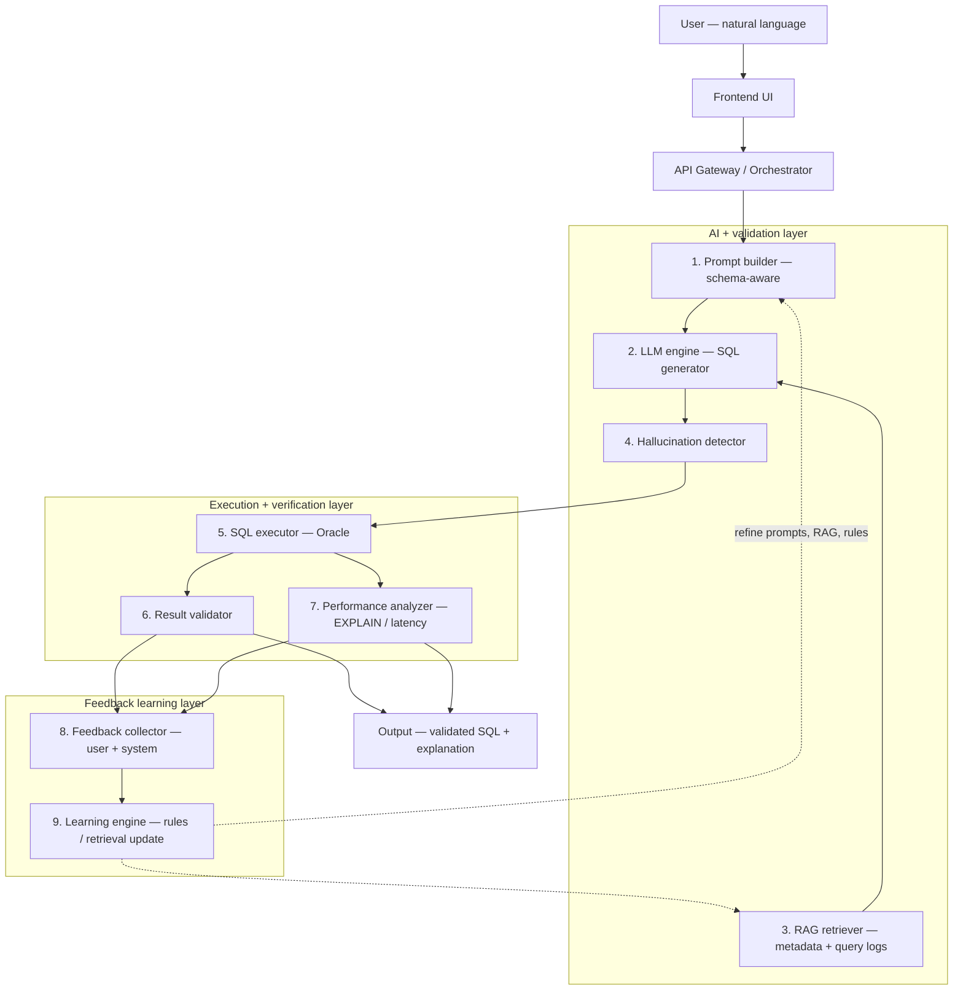

# PhraseSQL — Project Architecture

This document describes the architecture of the **PhraseSQL** NL2SQL project (LLM + Node.js Oracle) and what it achieves.

---

## What This Project Achieves

PhraseSQL is an **empirical evaluation framework** for **LLM-based natural language to SQL (NL2SQL)** using HTTP tools (historically described as MCP-style). It provides:

1. **Rigorous correctness evaluation** — Compares LLM-generated SQL against human-written baseline SQL on Oracle (TPC-H) by checking semantic match, exact row/order match, and canonical string match.
2. **Execution and optimization metrics** — Measures execution latency (baseline vs MCP), Oracle EXPLAIN PLAN (cost, cardinality, bytes), and identifies optimization gaps.
3. **Reproducible research** — 500-question TPC-H test set, three complexity tiers (simple / medium / complex), JSON results, and 13 graphs + 6 tables aligned with a research paper.
4. **Production-oriented insights** — Failure analysis (e.g. Oracle EXTRACT/QUARTER, column-prefix confusion), schema-hint refinement, and recommendations for safe deployment.

The project answers four research questions (RQ1–RQ4) and produces both **evaluation artifacts** (JSON, PNG, failure-case reports) and **research outputs** (LaTeX paper, figures, tables).

---

## High-Level Architecture

```
┌─────────────────────────────────────────────────────────────────────────────┐
│                           PhraseSQL NL2SQL System                             │
├─────────────────────────────────────────────────────────────────────────────┤
│                                                                             │
│  ┌──────────────┐     NL question      ┌─────────────────────────────────┐ │
│  │ sql-practice-│ ──────────────────► │  sql-learn-server.js (Node)      │ │
│  │ rules.json   │                      │  • POST /generate-sql (LLM)      │ │
│  │ (500 TPC-H)  │                      │  • Schema hint + Oracle rules    │ │
│  └───────┬──────┘                      │  • OpenAI-compatible API          │ │
│          │                             └──────────────┬────────────────────┘ │
│          │ baseline SQL                               │ generated SQL        │
│          ▼                                            ▼                      │
│  ┌──────────────────────────────────────────────────────────────────────┐  │
│  │              Evaluation (run_sql_evaluation.py)                        │  │
│  │  • Phase 1: Execute baseline SQL → rows, latency, EXPLAIN PLAN         │  │
│  │  • Phase 2: Call HTTP API for SQL, execute → rows, latency, EXPLAIN   │  │
│  │  • Compare: semantic_match, exact_order_match, extract_string_match   │  │
│  │  • Output: JSON result + console log (executed, semantic, cost_delta) │  │
│  └──────────────────────────────────────┬───────────────────────────────┘  │
│                                           │                                  │
│                    ┌──────────────────────┼──────────────────────┐          │
│                    ▼                      ▼                      ▼          │
│           ┌───────────────┐      ┌─────────────────┐      ┌─────────────┐  │
│           │ Oracle DB    │      │ visualize_       │      │ export_      │  │
│           │ (TPC-H)      │      │ results.py      │      │ failure_     │  │
│           │ oracledb     │      │ 13 graphs + 6    │      │ cases.py     │  │
│           │              │      │ tables (PNG)     │      │ failure_*.md │  │
│           └───────────────┘      └─────────────────┘      └─────────────┘  │
│                    │                      │                      │          │
│                    └──────────────────────┼──────────────────────┘          │
│                                           ▼                                  │
│  ┌──────────────────────────────────────────────────────────────────────┐  │
│  │  research/ — LaTeX paper, figures, tables; copy_results_to_research  │  │
│  └──────────────────────────────────────────────────────────────────────┘  │
│                                                                             │
└─────────────────────────────────────────────────────────────────────────────┘
```

---

## Execution-Grounded Hallucination Detection (RAG + Feedback Loop)

This section is the **target systems architecture** for papers and presentations: natural-language SQL generation where **ground truth comes from execution and comparison**, retrieval grounds the model in **schema and past queries**, and a **feedback loop** improves prompts, rules, or retrieval over time.

### High-level flow (modular)

```
User (Natural Language)
        ↓
Frontend UI (SQL learning / chat app)
        ↓
API Gateway / Orchestrator
        ↓
--------------------------------------------------
|           AI + Validation Layer                |
|                                                |
|  1. Prompt Builder (schema-aware)             |
|  2. LLM Engine (SQL generator)                |
|  3. RAG Retriever (metadata + query logs)     |
|  4. Hallucination detector                    |
--------------------------------------------------
        ↓
--------------------------------------------------
|        Execution & Verification Layer         |
|                                                |
|  5. SQL Executor (Oracle DB)                  |
|  6. Result Validator                          |
|  7. Performance Analyzer                      |
--------------------------------------------------
        ↓
--------------------------------------------------
|           Feedback Learning Layer             |
|                                                |
|  8. Feedback Collector (user / system)        |
|  9. Learning Engine (RL / rule update)        |
--------------------------------------------------
        ↓
Final Output (validated SQL + explanation)
```

The **hallucination detector** is *execution-grounded* when it uses Oracle outcomes (parse/execute errors, empty or implausible results, divergence from a gold or semantic baseline) rather than only static linting. The **feedback loop** closes when user corrections, telemetry, or batch evaluation updates prompts, RAG corpora, or guardrails.

### Diagram (Mermaid — GitHub, VS Code, export to SVG/PNG)



### Mapping to this repository (today vs extension)

| Layer | Component | Role in PhraseSQL today | Typical extension for full loop |
|-------|-----------|-------------------------|--------------------------------|
| AI + validation | 1. Prompt builder | `sql-learn-server.js` system prompts, `schema-reference.json`, TPC-H hints in evaluation | Dynamic schema snippets, per-session context windows |
| | 2. LLM engine | `POST /generate-sql`, OpenAI-compatible API | Multi-turn repair, structured output |
| | 3. RAG retriever | Book search (`book-index.js`, `BOOK_CONTEXT_IN_GENERATE`), schema JSON | Embedding index over **query logs** + lineage metadata |
| | 4. Hallucination detector | Implicit: Oracle errors on run; evaluation compares result sets | Explicit pre-exec checks + post-exec semantic vs baseline |
| Execution + verification | 5. SQL executor | `POST /api/invoke` → `run-sql`, `run_sql_evaluation.py` → `Database.execute` | Same; optional read-only role |
| | 6. Result validator | `semantic_match`, `exact_order_match`, `extract_string_match` in `run_sql_evaluation.py` | Online validator without gold SQL (consistency, bounds) |
| | 7. Performance analyzer | `Database.explain_plan`, latency in evaluation JSON | Surface cost deltas in UI |
| Feedback | 8. Feedback collector | User chat, optional `cra-telemetry.js` signals | Thumbs-up/down, corrected SQL logging |
| | 9. Learning engine | Batch runs → `export_failure_cases.py`, paper-oriented analysis | Rule/prompt updates from failure clusters |

---

## Component Overview

| Component | Role |
|-----------|------|
| **sql-learn-server.js** | HTTP server: learning UI, book index, natural-language → Oracle SQL via LLM (OpenAI-compatible API), TPC-H schema hints, Oracle rules. Guided “Listen” can use **ElevenLabs** (`ELEVENLABS_API_KEY`, `POST /guided-podcast-tts`) or the browser’s speech API. Evaluation uses **LLM mode only**. |
| **run_sql_evaluation.py** | Orchestrator: loads tests, baseline phase (gold SQL), generated-SQL phase (HTTP API), compares results (semantic, exact order, extract string), EXPLAIN PLAN, writes `sql_evaluation_*.json`. |
| **Oracle Database** | Runs baseline and generated SQL, returns rows and supports EXPLAIN PLAN (cost, cardinality, bytes). TPC-H schema; connection via oracledb (user/password/DSN). |
| **visualize_results.py** | Reads evaluation JSON and produces 13 graphs (e.g. complexity distribution, accuracy by tier, latency comparison, EXPLAIN deltas) and 6 table PNGs. Invoked automatically after a run unless `--no-visualize`. |
| **export_failure_cases.py** | From an evaluation JSON, builds a markdown report of failure cases with baseline SQL vs generated SQL and optional error/plan diff. |
| **research/** | LaTeX paper (main.tex, sections, figures, tables) and references. Documents methodology, results, failure analysis, and deployment recommendations. |

---

## Data Flow

1. **Input** — `experiments/sql-practice-rules.json`: list of `{ id, question, complexity, expected_sql }` (500 TPC-H questions) under key `test_questions`.
2. **Baseline phase** — For each test, evaluation engine executes `expected_sql` on Oracle, records rows, latency, and EXPLAIN PLAN (cost, cardinality, bytes).
3. **Generated-SQL phase** — For each test, engine sends `question` to `sql-learn-server.js` (LLM); server returns generated SQL; engine executes it on Oracle and records rows, latency, and EXPLAIN PLAN.
4. **Comparison** — For each test (when both baseline and generated SQL ran successfully): **semantic_match** (order-independent set), **exact_order_match** (rows + values + order), **extract_string_match** (canonical JSON). EXPLAIN deltas (cost, cardinality, bytes) are computed.
5. **Output** — `experiments/results/sql_evaluation_<timestamp>.json` (full results; legacy runs may use `mcp_evaluation_*.json`), console summary (RQ1–RQ4), and optionally 13 graphs + 6 tables + failure-case markdown.

---

## Repository Layout (Key Paths)

```
sql-learn/  (repo root)
├── sql-learn-server.js         # HTTP server (UI + LLM SQL generation)
├── book-index.js               # EPUB → searchable book chunks
├── schema-reference.json       # Static schema + tips for UI / fallback
├── .env                        # Config: LLM_API_KEY, ENABLE_LLM_SQL_GEN, DB_*, etc.
├── ARCHITECTURE.md             # This file
├── README.md                   # Quick start, CLI, API
├── docker-compose.yml          # Oracle 26ai Free (optional)
│
├── app/
│   └── index.html              # Main browser UI (GET /); also hosted on Netlify (easynlsql.netlify.app)
│
├── experiments/
│   ├── run_sql_evaluation.py   # Evaluation engine (RQ1–RQ4)
│   ├── visualize_results.py  # 13 graphs + 6 tables
│   ├── export_failure_cases.py
│   ├── sql-practice-rules.json # 500 TPC-H questions + expected SQL
│   └── results/                # sql_evaluation_*.json (legacy: mcp_evaluation_*.json)
│
└── research/                    # LaTeX paper and assets
    ├── main.tex
    ├── sections/                 # abstract, introduction, methodology, results, discussion, conclusion
    ├── figures/                 # .tex wrappers + PNGs (graphs/tables)
    └── tables/
```

---

## Research Questions (RQ) and Metrics

| RQ | Name | What is measured |
|----|------|------------------|
| **RQ1** | Semantic correctness | % of tests where MCP result set equals baseline (semantic + exact order + extract string reported). |
| **RQ2** | Execution efficiency | Baseline vs MCP latency (mean, median, p95, ratio by tier). |
| **RQ3** | Optimization potential | EXPLAIN PLAN cost/cardinality/bytes; count of MCP lower/same/higher than baseline. |
| **RQ4** | Robustness by complexity | Accuracy per tier (simple / medium / complex) and degradation across tiers. |

---

## Summary of Achievements

- **End-to-end NL2SQL evaluation** on Oracle TPC-H with LLM-only MCP.
- **Multiple comparison modes** by default: semantic, exact order, and extract string, plus EXPLAIN PLAN comparison.
- **Structured logs** per query: execution success, semantic/exact_order/extract_str, cost/cost_delta, latency, ratio.
- **Automated visualizations** (13 graphs, 6 tables) and **failure-case export** for debugging and paper writing.
- **Research-ready outputs**: LaTeX paper, synced figures/tables, and documented failure modes (e.g. Oracle EXTRACT/QUARTER, column naming).
