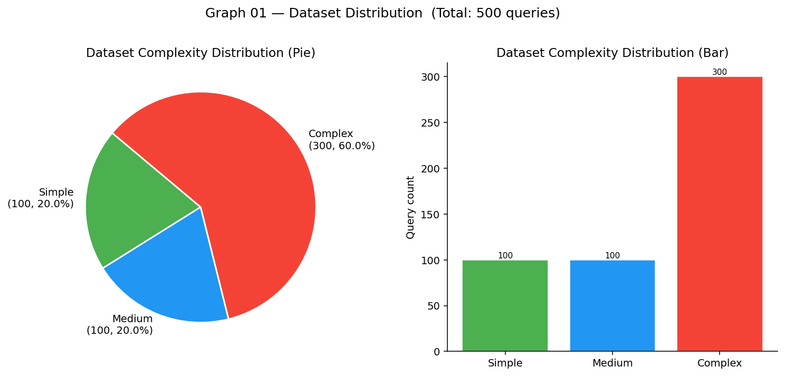
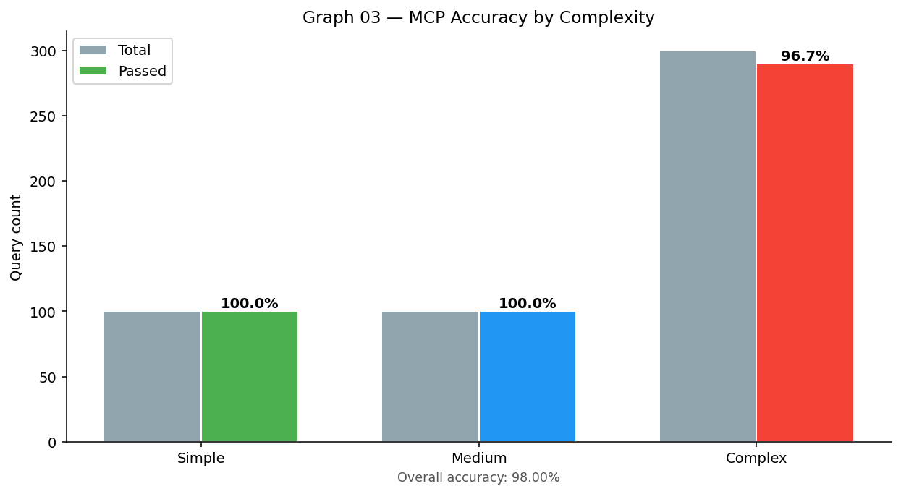
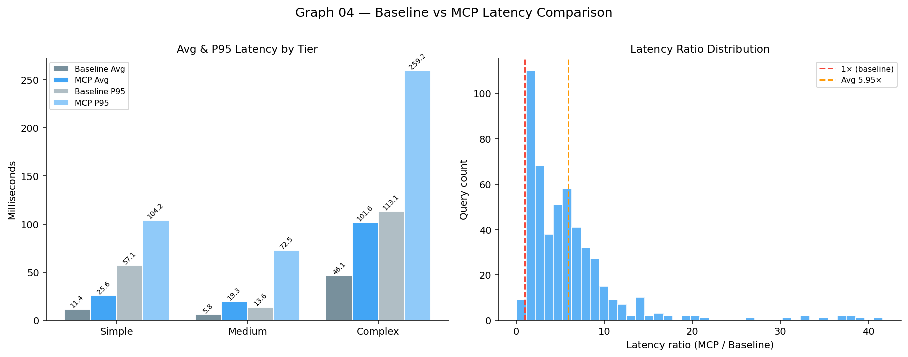
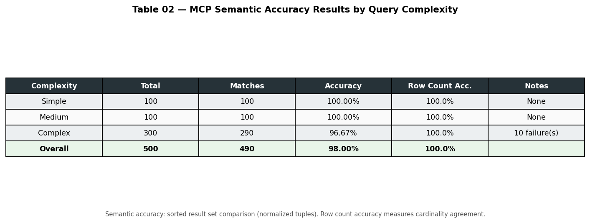
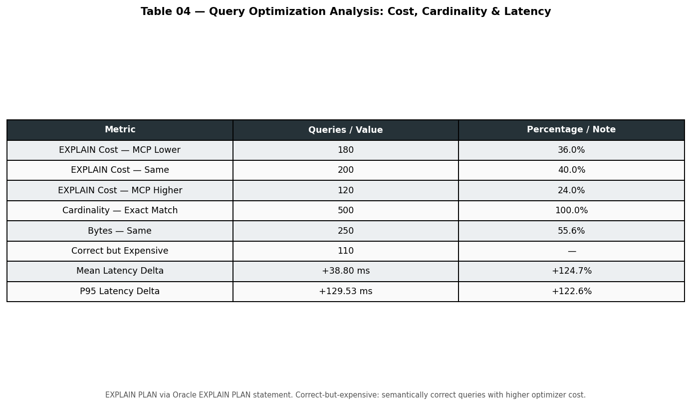

# Model Context Protocol (MCP) for NL2SQL: A Rigorous Evaluation Framework on Oracle Database

**DZone — Database / AI Zone**

**TL;DR** — SQLclMCP uses the Model Context Protocol (MCP) to evaluate LLM-generated SQL on Oracle: baseline vs MCP execution, semantic/order/string comparison, and EXPLAIN PLAN metrics on a 500-query TPC-H benchmark. Oracle-specific prompt rules (e.g. no EXTRACT(QUARTER), correct column prefixes) cut errors and improve match rates.

---

When you let an LLM turn natural language into SQL, you need to know: is it *correct*, will it *run* on your database, and is it *efficient*? **SQLclMCP** is an open-source framework that answers those questions by comparing LLM-generated SQL to human-written baselines on **Oracle Database**—using the **Model Context Protocol (MCP)** and a 500-question TPC-H benchmark. MCP keeps “how SQL is generated” behind a single HTTP API: the evaluator sends a question and gets back SQL, so you can swap models, prompts, or even the server implementation and still run the *same* evaluation. This article walks through the pipeline, how to run it, what gets measured, a few example graphs and tables, and Oracle gotchas we fixed in the prompt.

---

## Why This Matters

Natural language to SQL (NL2SQL) works well for ad-hoc questions and app backends—until the model returns the wrong rows or a query that fails or runs too slowly in production. To ship with confidence you need three guarantees: the result set is **correct** (same logical result as the intended query), the SQL **executes** on your database without syntax or runtime errors, and it’s **efficient** enough (reasonable latency and plan quality, e.g. Oracle EXPLAIN PLAN). The only reliable way to get those guarantees is to compare LLM output to a gold standard on a *real* database, in a **repeatable** pipeline—so you can improve prompts, compare models, and catch dialect gotchas (Oracle vs MySQL, EXTRACT vs LIMIT, and the like). This framework gives you that pipeline.

---

## How It Works: Pipeline and the Role of MCP

The pipeline has three stages. First, we run the **baseline**: for each of the 500 questions we execute the gold-standard SQL on Oracle and capture rows, latency, and EXPLAIN PLAN. Second, we run **MCP**: we send the same question to an MCP server, which calls an LLM to generate SQL; we then run that SQL on the same Oracle DB and capture the same metrics. The evaluator doesn’t care *how* the server produces SQL—only that it obeys the contract (question in, SQL out). Third, we **compare**: result-set equality (semantic, exact order, canonical string) and plan metrics (cost, cardinality, bytes). The MCP server is a small Node.js HTTP API; the evaluation runner is Python using **oracledb**. No heavy infra—just Oracle, Node, Python, and an OpenAI-compatible LLM.

**Why MCP fits here.** The evaluator expects only two HTTP endpoints: **GET /health** and **POST /generate-sql**. No LLM SDK, no prompt code, no server internals in the runner—so the evaluation logic (Python + Oracle) stays independent of who generates the SQL. You can point the runner at a different MCP server by changing a URL and get the same benchmark and metrics; that’s how you compare model A vs model B or prompt v1 vs v2 fairly. The server can run locally or on another host (`--mcp-url`), which helps with CI, remote LLM APIs, or different team environments. In short, MCP is the **boundary** between “evaluate on Oracle” and “generate SQL from natural language”—and that boundary is what makes the framework reusable across many ways of doing NL2SQL.

---

## What You Need

You’ll need Oracle Database with TPC-H (we use Oracle 26ai Free in Docker), Node.js for the MCP server, Python 3.10+ with `oracledb`, `requests`, and `matplotlib`, and an LLM API key (OpenAI or compatible). A full 500-query run can take 30–60+ minutes depending on LLM latency; for a quick smoke test you can use `--max-questions 10` or `--complexity simple` (see run options below).

---

## Get Up and Running in 4 Steps

The steps below keep evaluation (Python + Oracle, baseline vs generated) separate from SQL generation (MCP server + LLM). You start the server once; the runner calls it for every question. If you later replace the server or the LLM, you re-run the same steps and get comparable results.

**Step 1 — Start Oracle.**  
Run `docker-compose up -d` and wait about 60 seconds for Oracle to come up.

**Step 2 — Configure environment.**  
Create or edit `.env` with your LLM API key, model (e.g. `gpt-4o-mini`), and Oracle credentials (`DB_USER`, `DB_PASSWORD`, `DB_DSN=localhost:1521/FREE`). Set `ENABLE_LLM_SQL_GEN=true` so the MCP server can call the LLM.

**Step 3 — Start the MCP server.**  
Run `node mcp-server-http.js`. This server is the MCP boundary: it receives questions from the evaluator, calls your LLM, and returns generated SQL. The evaluator only talks to this HTTP API—it never imports an LLM SDK or sees your prompt, so swapping or upgrading the server doesn’t require changing the evaluation code.

**Step 4 — Run the evaluation.**  
From the repo root: `cd experiments` then `python3 mcp_evaluation.py --run-mode compare`. You’ll get baseline vs MCP comparison, EXPLAIN PLAN collection, and 13 graphs plus 6 tables in `experiments/results/` (timestamped JSON and PNG/CSV/HTML). Before that, a quick sanity check: `curl http://localhost:3000/health` should return OK. To run only five questions: `python3 mcp_evaluation.py --run-mode compare --max-questions 5`. If something fails, ensure the MCP server is running and `MCP_SERVER_URL` or `--mcp-url` matches; for Oracle connection errors (e.g. ORA-12154), check `DB_DSN` format (`host:port/service_name`) and that the DB user exists and has access to the TPC-H schema.

**Run options** you’ll use often: `--run-mode` can be `baseline` (gold SQL only), `mcp` (MCP only), or `compare` (both). Use `--complexity simple|medium|complex|all` to filter tiers, and `--max-questions N` to cap the run. You can skip EXPLAIN PLAN with `--no-explain` or skip graphs/tables with `--no-visualize`. The MCP server URL defaults to `http://localhost:3000` and can be overridden with `--mcp-url` or `MCP_SERVER_URL`. Use `--run-mode baseline` to validate the test set and DB without calling the LLM; use `--run-mode mcp` if you already have baseline results and only want to re-run MCP.

Once a run finishes, here’s what the numbers mean.

---

## What Gets Measured

The framework measures both correctness and efficiency. A query is counted as **correct** for accuracy when it executes successfully and **semantic match** is true—meaning the same set of rows as the baseline, order ignored. The runner also checks **exact order** and **extract string** (canonical JSON); those are stricter and useful for debugging or when row order matters. On the efficiency side it records **latency** (baseline vs MCP, and the ratio) and **EXPLAIN PLAN** (cost, cardinality, bytes, and deltas when they differ). All of this is logged per query and rolled up in the JSON and console summary. The table below is a quick reference.

| Metric | What it tells you |
|--------|-------------------|
| **Semantic match** | Same set of rows as baseline (order ignored). |
| **Exact order match** | Same rows, same order. |
| **Extract string match** | Same canonical JSON representation. |
| **Execution success** | Generated SQL ran without error. |
| **Latency** | Baseline vs MCP execution time and ratio. |
| **EXPLAIN PLAN** | Cost, cardinality, bytes — and deltas when they differ. |

---

## Graphs and Tables Produced

After each run (unless you pass `--no-visualize`), the framework writes 13 PNG graphs and 6 tables to `experiments/results/`. Below are a few representative examples from a sample run.

**Graph 01 — Complexity distribution** (test set composition by tier)



**Graph 03 — Accuracy by complexity** (MCP semantic accuracy by tier and overall)



**Graph 04 — Baseline vs MCP latency** (avg/P95 by tier and latency-ratio histogram)



**Table 02 — Accuracy results** (semantic accuracy by tier)



**Table 04 — Optimization metrics** (EXPLAIN cost, cardinality, bytes, latency deltas)



The full run also produces: *graphs* 02 (category distribution), 05–07 (success rates, coverage matrix, summary metrics), 08 (latency per query), 09–13 (EXPLAIN cost, deltas, cardinality, bytes, plan table); *tables* 01 (dataset summary), 03 (baseline performance), 05 (failure analysis), 06 (latency comparison). All outputs align with RQ1–RQ4 and can be used in reports or copied to a `research/` folder.

The same benchmark runs also surfaced several Oracle-specific failures. Encoding a few rules in the prompt fixed them; here’s what we learned.

---

## Oracle Gotchas We Hit (And Fixed in the Prompt)

Baking a few rules into the LLM prompt cut errors and improved match rates. Here are three that will save you time.

**EXTRACT(QUARTER ...) doesn’t exist in Oracle.** The model kept generating `EXTRACT(QUARTER FROM order_date)`. Oracle’s `EXTRACT` supports only `YEAR`, `MONTH`, `DAY`, `HOUR`, `MINUTE`, `SECOND`—not `QUARTER`. That produced ORA-00907. We fixed it by telling the prompt to use `CEIL(EXTRACT(MONTH FROM col)/3)` or `TO_CHAR(col,'Q')` for quarter, and to prefer date ranges for year filters (e.g. `col >= DATE '2023-01-01' AND col < DATE '2024-01-01'`).

**Wrong column prefix (L.P_PARTKEY vs L.L_PARTKEY).** In a CTE over `LINEITEM L`, the model sometimes selected `L.P_PARTKEY`. In TPC-H, `LINEITEM` has `L_PARTKEY`; `P_PARTKEY` is on `PART`. Oracle responded with ORA-00904. We fixed it by stating explicitly in the prompt: “LINEITEM has L_PARTKEY—use L.L_PARTKEY, never L.P_PARTKEY. PART has P_PARTKEY.”

**Use FETCH FIRST N ROWS ONLY, not LIMIT.** We require the model to use Oracle’s `FETCH FIRST N ROWS ONLY` instead of `LIMIT N`; the schema hint and instructions in the MCP server enforce this.

---

## Inspecting Failures

When a query fails or results don’t match, you want baseline SQL and generated SQL side by side. The repo includes a script that turns the evaluation JSON into a markdown report. Run:

```bash
python3 experiments/export_failure_cases.py --input experiments/results/mcp_evaluation_<timestamp>.json
```

If you omit `--input`, it uses the latest JSON in `experiments/results/`. The report includes a summary table (question ID, complexity, failure reason, row counts) and full SQL blocks for each failure—baseline first, then MCP-generated SQL, with any error message. That makes it straightforward to tune prompts and add schema hints.

---

## Benchmark and Reproducibility

The test set is 500 TPC-H questions in three tiers—simple, medium, complex—each with natural language text and expected Oracle SQL. The runner answers four research questions: **RQ1** correctness (semantic, order, string), **RQ2** latency (baseline vs MCP by tier), **RQ3** EXPLAIN PLAN (cost, cardinality, bytes and when they differ), and **RQ4** robustness (accuracy by complexity and degradation from simple to complex). Results are JSON plus PNGs and tables that you can plug into reports or a research pipeline; a separate script copies the latest graphs and tables into a `research/` folder for papers or docs.

---

## Key Takeaways

Automated evaluation of LLM-generated SQL against a gold standard on Oracle is feasible with a small MCP server and a Python runner. Multiple comparison modes (semantic, exact order, canonical string) plus EXPLAIN PLAN give you both correctness and efficiency signals. Dialect-specific prompt rules (EXTRACT, column names, FETCH FIRST) are essential for Oracle—and the same idea applies to other databases. The failure export (baseline vs MCP SQL) makes it easy to iterate on prompts and schema hints. For fast iteration use `--max-questions` or `--complexity simple`; run the full 500 when you need final numbers and research metrics.

---

## Conclusion

If you’re building or evaluating NL2SQL on Oracle, a repeatable pipeline that compares LLM output to baseline SQL and collects execution and plan metrics is a game-changer. SQLclMCP gives you that pipeline, a 500-query TPC-H test set, and concrete lessons on what to put in the prompt. Clone the repo, point it at your Oracle instance, and adapt the MCP server and hints for your schema.

---

## Resources

- **SQLclMCP repo:** [GitHub](https://github.com/your-org/SQLclMCP) *(replace with your repo URL)*
- **Model Context Protocol (MCP):** [modelcontextprotocol.io](https://modelcontextprotocol.io/) — standard for tool-augmented LLM apps
- **python-oracledb:** [oracle.github.io/python-oracledb](https://oracle.github.io/python-oracledb/)
- **Oracle Database Free:** [Oracle Container Registry](https://container-registry.oracle.com/)

---

**Tags:** Database, Oracle, SQL, LLM, NL2SQL, MCP, AI, Evaluation, TPC-H
